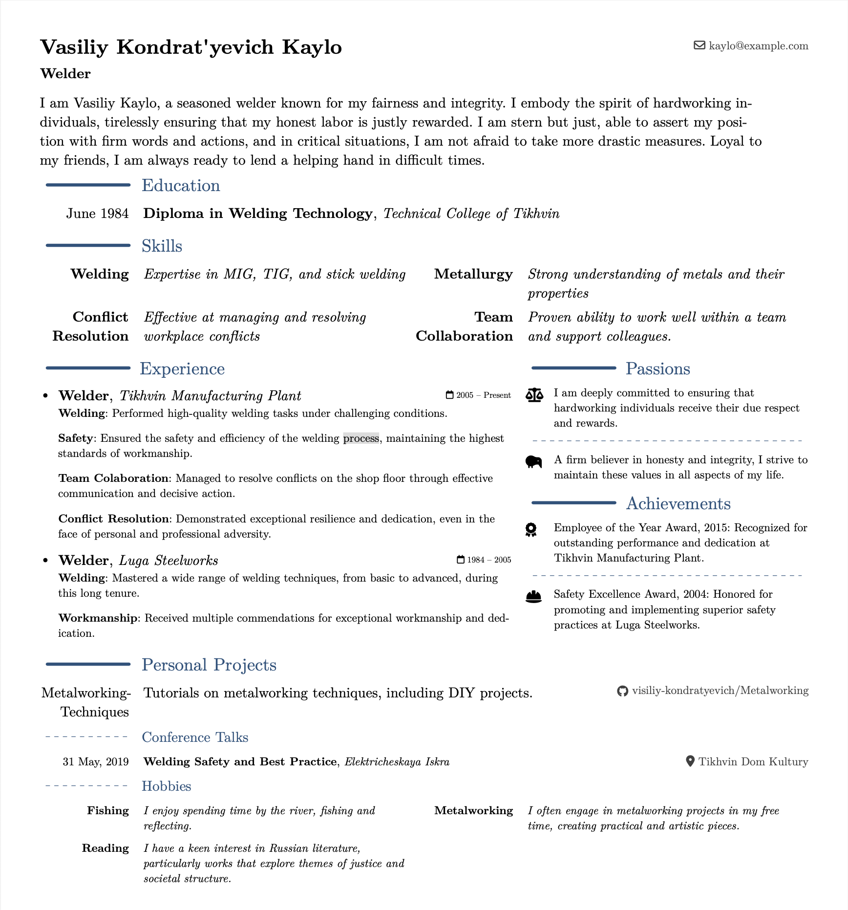

# beware-modern-cv

Modified [moderner-cv](https://typst.app/universe/package/moderner-cv) template.
Modernercv is a typst adaptation of LaTeX's [moderncv](https://github.com/moderncv/moderncv),
a modern curriculum vitae class.

## Name
- The name of this template pays homage to the TV shows "Ostorozhno Modern" and "Polny Modern".
- "Kaylo" was chosen for the example PDF, reflecting our shared experience of growing up in Leningrad Oblast.

## Using This Template
- Don't Use This Template as a Package
  - Avoid searching for the "correct" CV template or "best practice"
  - Take the time you need to present yourself in a way that feels most satisfying and authentic to you.
  - This approach primes interviewers for discussions that are most meaningful to you.
    - If this conflicts with the interviewer's expectations, it may indicate that the role isn't the right fit for you.

- Do Use This Template as a Starting Point
  - Starting with a blank page can be overwhelming. Feel free to adapt and modify this template to suit your needs.
  - Refer to the "Building and Testing Locally" section for guidance on customization.

## Requirements

This template uses FontAwesome icons via the [fontawesome typst package](https://typst.app/universe/package/fontawesome).
In order to properly use it, you need to have fontawesome installed on your system or have typst configured (via `--font-path`) to use the fontawesome font files.
You can download fontawesome [here](https://fontawesome.com/download).

## Usage

```typst
#import "@local/beware-modern:0.1.0": *

#show: beware-modern-cv.with(
  name: "Vasiliy Kondrat'yevich Kaylo",
  subtitle: "Welder",
  lang: "en",
  social: (
    email: "kaylo@example.com",
    // github:,
    // linkedin:,
    // web:,
    // phone,
  ),
)

// For introductory words about you
#intro([...])

// Showcase your degrees
#education(
  date: [...],
  degree: [...],
  institution: [...]
)

// Showcase your primary skills
#cv-category-grid((
  "Skill Category 1": [...],
  "Skill Category 2": [...],
  "Skill Category 3": [...],
  "Skill Category 4": [...],
))

// You career experience
#cv-career-experience(
  positions: (
    (
      date: [...],
      employer: [...],
      title: [...],
      projects: ( ( short: [...], details: [...] ), )
    ),
  ),

  passions: ( ( icon: "...", content: [...] ), ),
  achievements: ( ( icon: "...", content: [...] ), )
)

// Any github repos you want to show
#cv-repo( name: [...], description: [...], github: "user/repo" )

// Any conference talks
#cv-talk( date: [...], event: [...], title: [...], venue: [...] )

// Similar to #cv-category-grid, but when you need more space
#cv-small-category-list(( "Category 1": [...], "Category 2": [...] ))

// Similar to #cv-repo, but for generic line with date
#cv-small-entry-with-date(date: [...], name: [...], [description: [...]])
```

## Examples



## Building and Testing Locally

To build and test the template locally, you can run `pixi run watch` in the root of this repository.
Please ensure to have linked this package to your local typst packages, see [here](https://github.com/typst/packages#local-packages):

```bash
# linux
mkdir -p ~/.local/share/typst/packages/preview/beware-modern-cv
ln -s $(pwd) ~/.local/share/typst/packages/preview/beware-modern-cv/0.1.0

# macos
mkdir -p ~/Library/Application\ Support/typst/packages/preview/beware-modern-cv
ln -s $(pwd) ~/Library/Application\ Support/typst/packages/preview/beware-modern-cv/0.1.0
```
